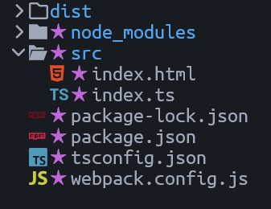

# TS + HTML: LiveReload + HMR (webpack)

## **1. Preparation**

```bash
npm install --save-dev typescript webpack webpack-cli webpack-dev-server ts-loader html-webpack-plugin
```

`html-webpack-plugin` is used to generate html file in /dist. 

------

## **2. Project Directory**



------

## **3. Key Configurations**

- (package.json): scripts/dev: "webpack server --mode development --open"
- (tsconfig.json): all
- (webpack.config.js): all
